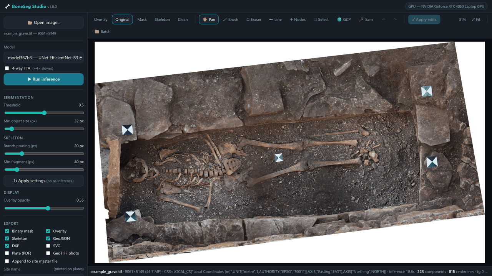
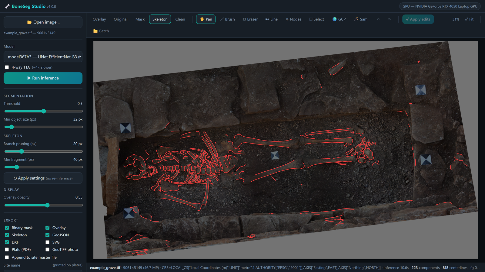
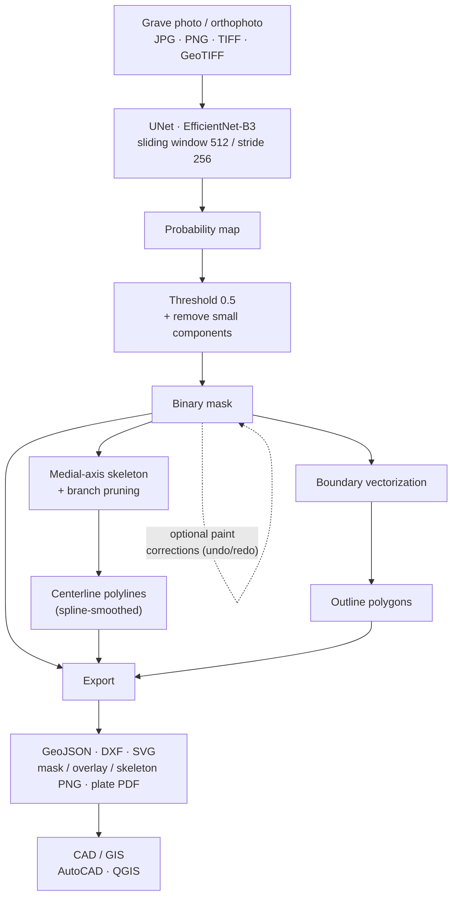
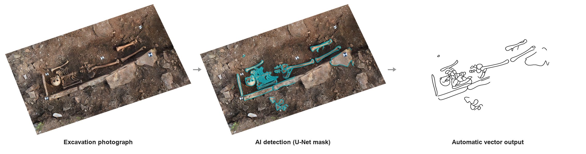
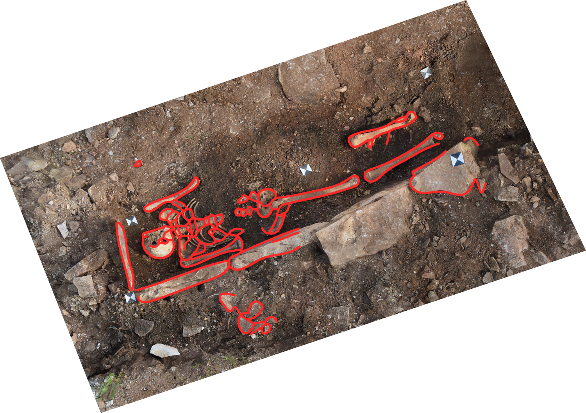
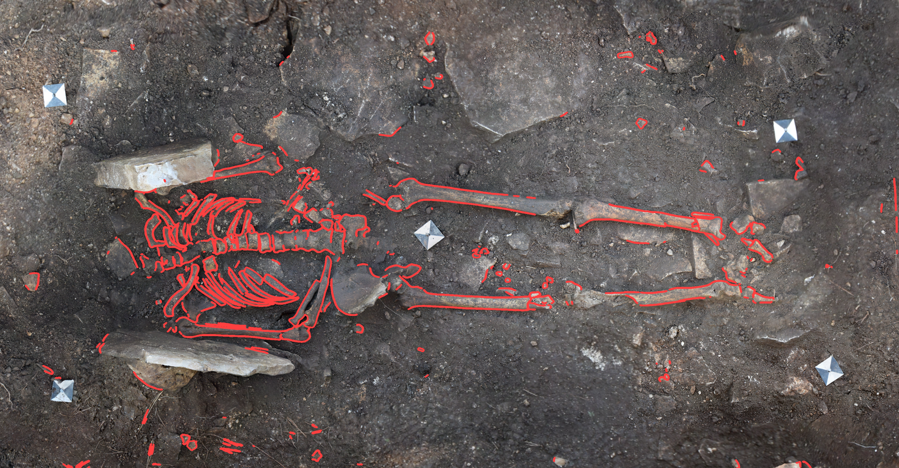

# 🦴 BoneSeg Studio

A fully-offline desktop application for **archaeological bone
segmentation, skeletonization and vectorization**. It wraps the trained
`model367b3` UNet (EfficientNet-B3) in a fast local web interface
(FastAPI backend + hand-written Canvas 2D frontend — no Gradio, no WebGL,
no build step): load an orthophoto or grave photo, run inference, inspect
the mask / overlay / skeleton, paint corrections with full undo/redo,
tune the postprocessing live, and export vectors for your drawing workflow.

Everything runs locally on Windows. **No cloud, no external APIs, no Docker.**


*A grave photograph the model had **never seen**, end to end: photograph →
U-Net detection → vectorized bone outlines → CAD/GIS-ready line drawing.
Unretouched output at default settings.*

---

## The application



*The interface: load a grave photo, run one-click inference, then flip between
the original photo, the red skeleton over the photo, and the clean CAD-ready
line drawing.*

**No manual editing** — every line above is raw `model367b3` output on a
held-out grave at default settings, captured live from the running app.

<p align="center">
  
</p>

---

## Highlights

- **One-click inference** on JPG / PNG / TIFF / **GeoTIFF** (drag & drop or browse).
- Reuses the **validated `predict.py` pipeline** exactly: sliding-window
  512 px patches, stride 256 overlap-averaging, threshold 0.5, optional
  4-way TTA, mixed precision on CUDA.
- **Automatic GPU/CPU** selection — CUDA is used when available, otherwise
  the app silently falls back to CPU. Nothing to configure.
- **Live postprocessing**: move the threshold / min-size / pruning sliders and
  hit *Apply settings* to re-render **without re-running the network** (the
  probability map is cached).
- **Skeletonization** with branch pruning and isolated-fragment removal for
  clean archaeological centerlines.
- **Vectorization** to **GeoJSON** (centerlines + outline polygons, in the
  input CRS when georeferenced) and **SVG** (image-aligned, for Illustrator /
  Inkscape).
- **Batch mode**: point at a folder, get one output subfolder per image plus a
  `batch_summary.json`.
- **Georeferencing preserved** end-to-end: GeoTIFF inputs keep their CRS in the
  mask raster and GeoJSON outputs.
- Rotating **file logging**, graceful **error handling**, and a modular
  architecture that keeps inference, post-processing and export cleanly
  separated.

---

## Installation

### 1. Prerequisites

- Windows 10/11
- Python 3.11
- (Optional) An NVIDIA GPU with a recent driver for CUDA acceleration. The app
  works on CPU too — it just runs slower.

### 2. Create a virtual environment

```powershell
cd BoneSegStudio
python -m venv .venv
.\.venv\Scripts\Activate.ps1
python -m pip install --upgrade pip
```

### 3. Install dependencies

PyTorch is installed from the PyTorch index (choose the build that matches
your machine), the rest from PyPI.

**GPU (CUDA 12.1):**
```powershell
pip install torch==2.5.1+cu121 torchvision==0.20.1+cu121 --index-url https://download.pytorch.org/whl/cu121
pip install -r requirements.txt
```

**CPU only:**
```powershell
pip install torch==2.5.1 torchvision==0.20.1
pip install -r requirements.txt
```

> The app auto-detects the absence of CUDA and runs on CPU — no code change
> needed.

---

## Running the application

```powershell
python app.py
```

This opens the app in your browser (**http://127.0.0.1:7860**, or the next
free port if 7860 is taken — the actual URL is printed in the console).
The server binds to localhost only; no data leaves the machine.

Useful flags:

| Flag | Effect |
|------|--------|
| `--port 7861` | Force a specific port (default: auto-pick the first free port from 7860) |
| `--no-browser` | Don't auto-open the browser |
| `--host 0.0.0.0` | Expose on the LAN (off by default) |

### Using it

1. Drop an image anywhere (or **Open image…**), click **Run inference**.
2. Inspect the **Overlay / Original / Mask / Skeleton** view modes; the
   status bar shows the result stats.
3. Adjust sidebar sliders and click **Apply settings** to re-run only the
   fast postprocessing stage. The **overlay opacity** slider updates live.
4. Correct the mask directly on the image: **Brush** adds bone, **Eraser**
   removes it, **Select** picks a whole connected component with one click
   (press **Delete** to remove it). **Ctrl+Z / Ctrl+Y** undo/redo any step.
   **Apply edits** rebuilds the skeleton and vectors from your correction.
5. Correct the **centerlines directly**: the **Line pen (P)** draws
   centerlines in any view (they become vector centerlines verbatim —
   never pruned as noise); over the **Skeleton / Clean** views the Eraser
   and Select tools act on centerlines instead of the mask. Direct
   centerline edits survive further mask edits and re-applies; they reset
   only when you re-run inference or *Apply settings*.
   The Skeleton/Clean views render the **actual spline-smoothed vector
   polylines** (crisp at any zoom, like GIS/CAD) — exactly the geometry
   the GeoJSON/DXF export writes, so what you see is what you get. While
   you are mid-edit the view temporarily shows the raster edit layer;
   after *Apply edits* it returns to crisp vectors.
6. Pick formats under **Export** and click **Export**.
7. **Save to training set** — writes `images/<stem>.png`,
   `masks/<stem>.png`, `overlays/<stem>.png` and updates
   `dataset_manifest.csv` in a staging folder
   (default `~/Desktop/UNET_STAGING`), so corrected pairs can later be merged
   into your training dataset by a plain folder copy. The saved mask includes
   all your applied edits.
8. **Batch** (toolbar) — paste an input folder and an output folder, click
   **Process folder**.

### Viewer controls

| Input | Action |
|-------|--------|
| Mouse wheel | Zoom to cursor (any tool, any zoom level) |
| Drag (Pan tool), middle-drag, right-drag, Space+drag | Pan — always available, no zoom required |
| Double-click (Pan tool) / `F` / **Fit** | Fit image to window |
| `B` / `E` / `P` / `S` / `H` | Brush / Eraser / Line pen / Select / Pan |
| `[` `]` | Tool size down/up |
| `1` `2` `3` `4` `5` | Overlay / Original / Mask / Skeleton / Clean view |
| Ctrl+Z / Ctrl+Y | Undo / redo mask edits |
| Delete | Delete the selected component |

---

## Project structure

```
BoneSegStudio/
├── app.py                       # launcher (argument parsing + launch)
├── requirements.txt             # pinned dependencies
├── README.md
├── boneseg/                     # the package (headless-usable, no web code except webui/)
│   ├── config.py                # dataclasses: all settings + paths
│   ├── logging_setup.py         # rotating file + console logging
│   ├── pipeline.py              # orchestrates one image / batch end-to-end
│   ├── models/
│   │   └── registry.py          # ModelSpec registry + weight loaders (extensible)
│   ├── inference/
│   │   ├── device.py            # CUDA detection + CPU fallback
│   │   └── engine.py            # sliding-window inference (ported from predict.py)
│   ├── data/
│   │   ├── readers.py           # PIL / rasterio image loading
│   │   └── writers.py           # mask, overlay, skeleton, GeoJSON, SVG writers
│   ├── postprocessing/
│   │   ├── cleanup.py           # threshold + small-object removal
│   │   ├── skeleton.py          # medial axis + graph pruning
│   │   └── vectorize.py         # skeleton→polylines, mask→outline rings
│   └── webui/
│       ├── server.py            # FastAPI endpoints + server-side state
│       └── static/              # index.html, app.css, app.js (vanilla, Canvas 2D)
├── tests/
│   └── smoke_test.py            # headless end-to-end test
├── logs/                        # boneseg.log (rotating) — created at runtime
├── uploads/                     # images opened via the browser — created at runtime
└── outputs/                     # default export location — created at runtime
```

**Layering rule:** only `boneseg/webui` imports FastAPI. The entire processing
pipeline (`inference`, `data`, `postprocessing`, `pipeline`) is usable
headless from scripts and notebooks — see `tests/smoke_test.py`.

**Why no Gradio?** The Gradio ImageEditor (WebGL-based) crashed to a white
screen when switching brush/eraser on large photos and lost all edits, and
its canvas had no reliable mouse panning. The current frontend is ~600 lines
of dependency-free JavaScript on a 2D canvas: pan/zoom always available,
stroke-level undo/redo, one-click component selection, and mask edits are
applied to the full-resolution mask as a sparse diff.

---

## Model & pipeline



- **Model:** UNet + EfficientNet-B3, 1 output class, 13.16 M parameters
  (`model367b3`, trained on 367 annotated grave photographs).
- **Weights:** not included in this repository (large binary + tied to
  unpublished training data). Point the app at a local checkpoint via the
  `BONESEG_MODEL_PATH` environment variable, or the default
  `models/model367b3/best_bone_model.pth` (see `boneseg/config.py`).
- **Inference:** reflect-padded sliding window (patch 512, stride 256),
  sigmoid probabilities averaged over overlaps; optional 4-way flip TTA.
- **Postprocessing:** threshold (default 0.5) → remove small components →
  medial-axis skeleton → prune short terminal branches and isolated fragments
  → spline-smoothed centerline polylines.
- **Coordinates:** georeferenced inputs produce geo-space rasters, GeoJSON and
  DXF in the input CRS; plain images use pixel coordinates with Y negated to
  match QGIS's placement of an ungeoreferenced raster (identical to `predict.py`).
- **Exports:** mask raster, overlay PNG, skeleton PNG, GeoJSON (centerlines +
  polygons), **DXF** (AutoCAD R2010, layers BONE_OUTLINE / BONE_CENTERLINE —
  open in AutoCAD and save as DWG there), SVG.
- **Site master file:** the *Append to site master file* option merges every
  exported grave into ONE site file set in the output directory:
  `master.gpkg` (GeoPackage — true per-grave layers `<grave>_outlines` /
  `<grave>_centerlines` in QGIS), `master.dxf` (per-grave CAD layers) and
  `master_centerlines/outlines.geojson` (single layer with an `image`
  attribute — GeoJSON has no layer concept). Re-export replaces instead of
  duplicating. Georeferenced graves land at their true world positions;
  plain photos are laid out in a strip.
- **Viewer:** scroll = zoom, drag = pan, double-click = reset on the
  Overlay / Original / Mask / Skeleton tabs.

To point at a different checkpoint, edit `DEFAULT_MODEL_PATH` in
`boneseg/config.py`, or register a second model in
`boneseg/models/registry.py` (it will appear in the UI model dropdown).

---

## GPU support

The device is chosen automatically at startup and shown in the header and the
Result info panel:

- **GPU** — used whenever `torch.cuda.is_available()` succeeds. Mixed precision
  (AMP) is enabled on CUDA for speed.
- **CPU** — automatic fallback; correct but slower (a 12 MP photo takes a few
  minutes instead of ~20 s).

If you installed the CPU-only PyTorch wheels, the app runs on CPU with no
changes. If a CUDA build can't reach the driver, the app logs a warning and
degrades to CPU rather than crashing.

---

## Example output



*The three stages side by side (still frame): excavation photograph → U-Net
bone detection → automatic vector line drawing.*



The detected bone outlines (red) drawn back over the input photograph — skull,
ribs, vertebrae and long bones are each segmented, then written to GeoJSON /
DXF / SVG. Both figures are raw model output at default settings (threshold
0.5, min object 32 px) — no manual cleanup.



---

## Troubleshooting

| Symptom | Fix |
|---------|-----|
| **"Model weights not found"** | Check `DEFAULT_MODEL_PATH` in `boneseg/config.py` points at `best_bone_model.pth`. |
| **App opens but inference is slow** | You're on CPU. Install the CUDA PyTorch wheels (see Installation) and confirm the header shows "GPU — …". |
| **CUDA out of memory** | Close other GPU apps; the model itself is small (13 M params) but very large orthophotos allocate big overlap buffers. Split the image or run on CPU. |
| **rasterio / GDAL install fails** | Install from a prebuilt wheel (`pip install rasterio==1.4.4`); rasterio bundles GDAL on Windows. TIFFs still load via PIL if rasterio is absent — you just lose georeferencing. |
| **"Unsupported file type"** | Only JPG/PNG/TIFF/GeoTIFF are accepted. |
| **Skeleton is empty** | `sknw` may be missing (`pip install sknw`), or the mask is empty at the current threshold — lower the threshold and *Apply settings*. |
| **Port 7860 in use** | The launcher now auto-selects the next free port and prints the URL. To force one: `python app.py --port 7861`. |
| **Logs** | See `logs/boneseg.log` (rotating, 5 MB × 5). Model loading, inference, export and errors are all recorded. |

---

## Future roadmap

The architecture was designed so this slots in with minimal refactoring:

- **Alternative / additional models** — add a `ModelSpec` + builder in
  `boneseg/models/registry.py` and the UI dropdown updates automatically. New
  model families register their own builder without touching the rest of the
  pipeline, which stays model-agnostic.
- **Configurable catalogue plates** — the current A4 plate is a fixed
  drawing-only layout (scale bar, north arrow, title block) and batch mode
  already stacks them into one `catalog.pdf`. Configurable templates —
  photo-and-drawing side by side, custom title-block fields, alternate paper
  sizes — build on the existing `render_plate_figure` / `PipelineResult`.

---

## About

Research tool developed as part of a personal project on automatic
vectorization of archaeological finds. It is built around a U-Net
(EfficientNet-B3 encoder, `model367b3`) trained on a curated dataset of
excavation photo / bone-outline pairs.

The trained weights and all archaeological source data (photographs, drawings,
survey coordinates) are **not** included in this repository — the code is the
shared artifact. The demo images above use a photograph the model was never
trained on.

---

## License

Released under the [MIT License](LICENSE) — free to use, modify and distribute
with attribution. The license covers the **code only**; the trained weights and
archaeological source data are not part of this repository and are not licensed
here.
